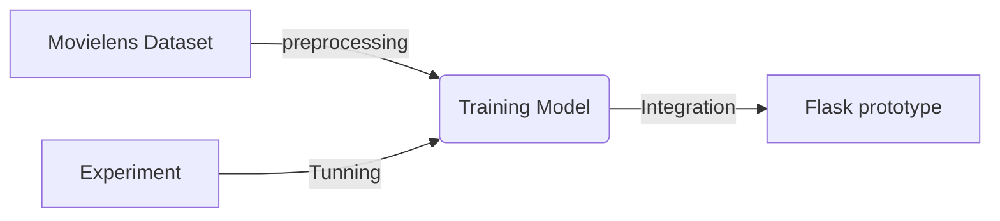

# Recomendation Systems Using Alternating Least Square With Pyspark, Implemented on Flask Framework


- **Framework**: Flask
    - flask_bcrypt
    - flask_wtf
    - flask_paginate
- **Database**: MongoDB
    - pymongo
    - mongo-connect (pyspark package)
- **Styling**: Tailwindcss
    - @tailwindcss/forms
- **Apache Spark**: Pyspark

## Overview
### Demo

### Data

* **ml-latest-small** - Small Movielens datasets
* **data.json** - contains results of scraped data from **to_json.py**

### Application Flow 


### Scraping 

* __selection.py__ - Select imdbIds of movies of different genres with format dictionary with tag genre for key and list of imdbId as value

* __scrape.py__ - Uses bs4 and Requests to extract imdbId, title, year, poster, rating, summary, time, genres. return with json dumps

* **to_json.py** - the scraped movies data append to list in json format with **data.json** and empty **"[]"**. _It's a bit weird to add empty list in file. but, its work!_
 __saving in json to handle__: adding movieId and imdbId to confirm both id is match, for processing multiple genres in each movie and ensure that genres data type is array,m l/m in database, for processing when want to put certain data, ex: only year less than or more than, etc.

### Experiment ALS
* **CF_ALS.ipynb** - this notebook represent experiment ALS with hyperparameter tuning and preprocessing data both used in ALS and Web Application. pyspark with mongo-connect responsibility to handle inserting data to mongodb after preprocessing. 

### Flask Web Application
Web Aplication is on **Web** Folder

* **Static folder** - Contains css config for tailwindcss, javascript to handle rating display and more static file.

* **Templates folder** - Contains HTML handled with jinja2
1. _layouts folder_  for base templating to share layouts contains header, footer
2. _other folder and file_ represent handle page for each other owned file or folder name.

## Running Web App Locally

assume if installed dependencies and adding config
- installed node (for tailwindcss), python, and apache spark
- Make sure to config mongodb port in web/app.py

```bash
pip install -r requirements.txt
cd web
npm install 
npm run watch
python app.py 
```

